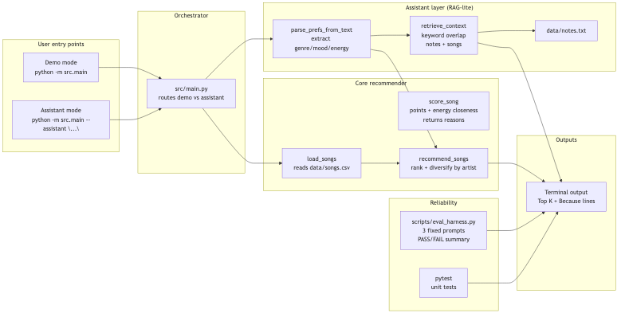
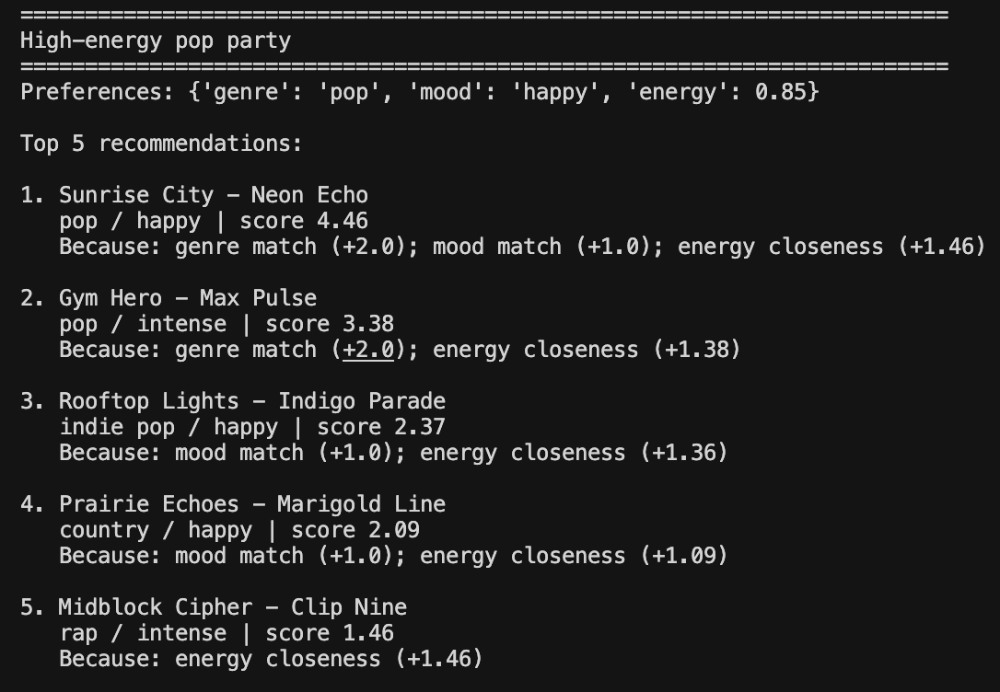
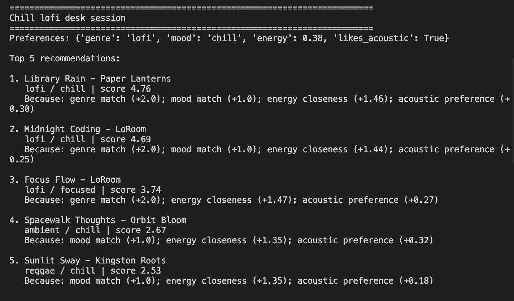
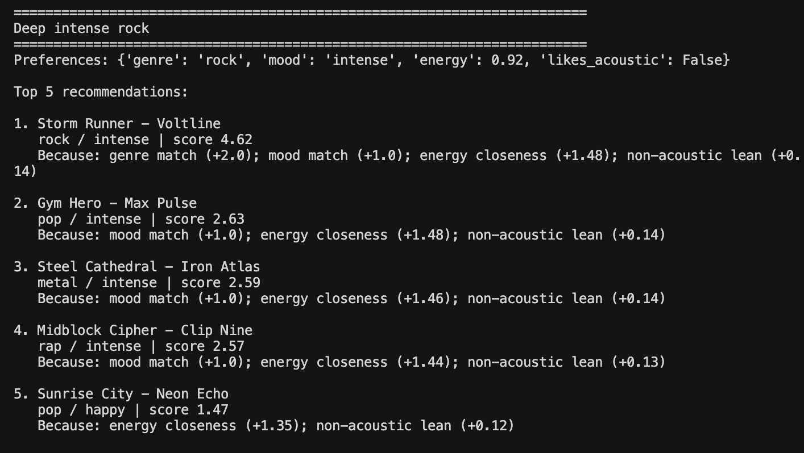
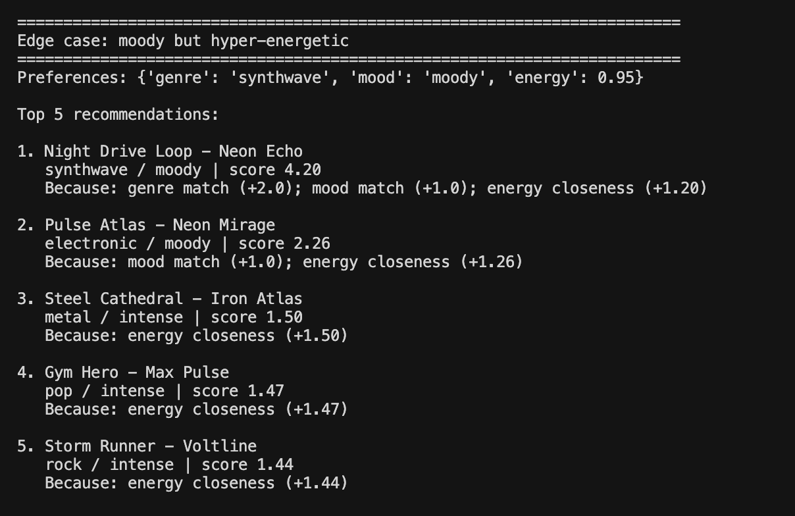
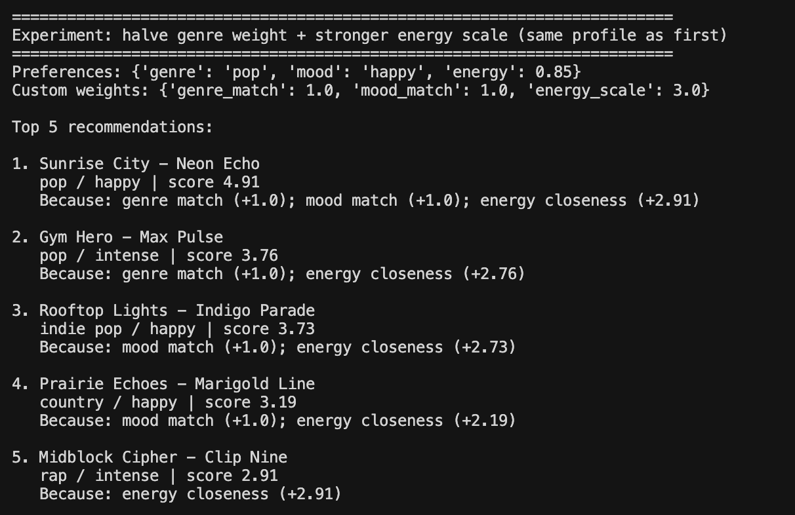

# Applied AI System: VibeGuide

## Base project I extended

This started as my Module 3 music recommender simulation. The original goal was simple: read songs from a CSV, score them based on a small taste profile, and print the top results with reasons. It was a content based ranking demo, not a real product.

## Title and summary

VibeGuide takes a normal sentence like what you would text a friend and turns it into a short list of songs, with reasons.

## Architecture overview

The main pieces are:

- A recommender that scores and ranks songs from data/songs.csv.
- A retriever that pulls relevant context from data/notes.txt and the song sheet.
- A generator that writes the final response text.
- A small eval harness that runs fixed inputs and prints pass or fail.

The diagram lives in assets/system_diagram.mmd. Screenshots live in assets/screenshots.



## Setup instructions

1. Install dependencies:

```bash
pip install -r requirements.txt
```

2. Run demo mode (profiles and experiment):

```bash
python -m src.main
```

3. Run assistant mode (natural language question):

```bash
python -m src.main --assistant "Recommend chill lofi for studying, low energy, acoustic please"
```

## Sample interactions

Example 1:

Input:
Recommend chill lofi for studying, low energy, acoustic please

Output:
Loaded songs: 18
Here is what I picked based on your question. I used the song sheet plus notes (retrieved sources: data/notes.txt, song:2, song:4, song:6, song:9).

1. Library Rain - Paper Lanterns (score 4.73)
   Because: genre match (+2.0); mood match (+1.0); energy closeness (+1.42); acoustic preference (+0.30)
2. Midnight Coding - LoRoom (score 4.57)
   Because: genre match (+2.0); mood match (+1.0); energy closeness (+1.32); acoustic preference (+0.25)
3. Spacewalk Thoughts - Orbit Bloom (score 2.79)
   Because: mood match (+1.0); energy closeness (+1.47); acoustic preference (+0.32)
4. Sunlit Sway - Kingston Roots (score 2.41)
   Because: mood match (+1.0); energy closeness (+1.23); acoustic preference (+0.18)
5. Campfire Arithmetic - Wild Pines (score 1.76)
   Because: energy closeness (+1.46); acoustic preference (+0.31)

Example 2:

Input:
I want intense rock for a workout, high energy, not acoustic

Output:
Loaded songs: 18
Here is what I picked based on your question. I used the song sheet plus notes (retrieved sources: data/notes.txt, song:3, song:5, song:11, song:16).

1. Storm Runner - Voltline (score 4.54)
   Because: genre match (+2.0); mood match (+1.0); energy closeness (+1.41); non-acoustic lean (+0.14)
2. Midblock Cipher - Clip Nine (score 2.59)
   Because: mood match (+1.0); energy closeness (+1.46); non-acoustic lean (+0.13)
3. Gym Hero - Max Pulse (score 2.52)
   Because: mood match (+1.0); energy closeness (+1.38); non-acoustic lean (+0.14)
4. Steel Cathedral - Iron Atlas (score 2.49)
   Because: mood match (+1.0); energy closeness (+1.35); non-acoustic lean (+0.14)
5. Sunrise City - Neon Echo (score 1.58)
   Because: energy closeness (+1.46); non-acoustic lean (+0.12)

Example 3:

Input:
Give me something moody and high energy, synthwave vibe

Output:
Loaded songs: 18
Here is what I picked based on your question. I used the song sheet plus notes (retrieved sources: data/notes.txt, song:8, song:18).

1. Night Drive Loop - Neon Echo (score 4.35)
   Because: genre match (+2.0); mood match (+1.0); energy closeness (+1.35)
2. Pulse Atlas - Neon Mirage (score 2.41)
   Because: mood match (+1.0); energy closeness (+1.41)
3. Midblock Cipher - Clip Nine (score 1.46)
   Because: energy closeness (+1.46)
4. Storm Runner - Voltline (score 1.41)
   Because: energy closeness (+1.41)
5. Gym Hero - Max Pulse (score 1.38)
   Because: energy closeness (+1.38)

## Design decisions

I kept the scoring math from the original project because I wanted the rankings to be easy to explain. I added the assistant layer so you can type a normal request and still get a ranked list with clear reasons.

## Testing summary

- Unit tests: pytest.
- Eval harness: python -m scripts.eval_harness runs three fixed prompts and checks the output has the important parts.

## Reflection

This project made it obvious that a working AI project is more than one magic function. It is data, a few rules, and a way to check it did what you think it did. It also made bias feel real. If a genre is missing from the sheet, the system cannot recommend it, no matter how good the code is.

## Assets and screenshots








